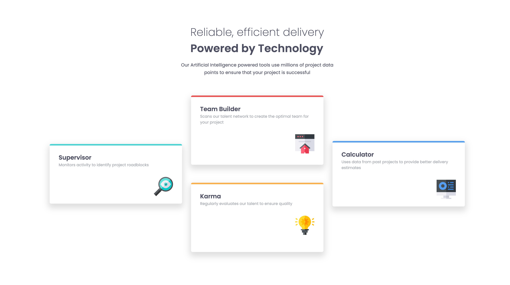

# Frontend Mentor - Four card feature section solution

This is a solution to the [Four card feature section challenge on Frontend Mentor](https://www.frontendmentor.io/challenges/four-card-feature-section-weK1eFYK). Frontend Mentor challenges help you improve your coding skills by building realistic projects.

## Overview

### The challenge

Users should be able to:

- View the optimal layout for the site depending on their device's screen size

### Screenshot

### Links

- Solution URL: [https://github.com/metinahmeterkeles/Four-Card-Feature](https://github.com/metinahmeterkeles/Four-Card-Feature)
- Live Site URL: [https://four-card-feature-three-opal.vercel.app/](https://four-card-feature-three-opal.vercel.app/)

## My process

### Built with

- Semantic HTML5 markup
- CSS custom properties
- CSS Grid
- Mobile-first workflow

### Useful resources

- [https://css-tricks.com/snippets/css/complete-guide-grid/](https://css-tricks.com/snippets/css/complete-guide-grid/)

## Author

- Website - [https://github.com/metinahmeterkeles](https://github.com/metinahmeterkeles)
- Frontend Mentor - [https://www.frontendmentor.io/profile/metinahmeterkeles](https://www.frontendmentor.io/profile/metinahmeterkeles)
